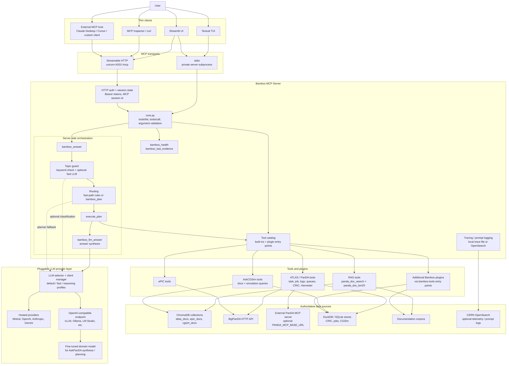
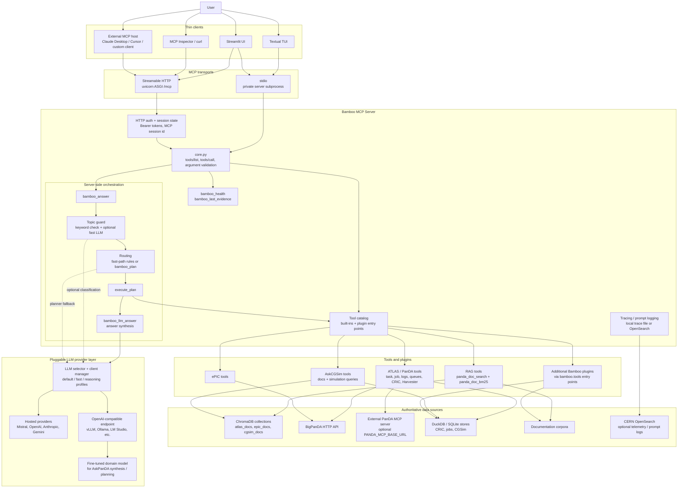

# Bamboo System Architecture

Bamboo is a tool-first MCP runtime. User interfaces are thin clients; routing,
tool execution, evidence handling, and LLM calls are handled server-side by the
Bamboo MCP server.

## Component Roles

- **Thin clients** hold the user interaction and conversation history. They call
  Bamboo over MCP using stdio or Streamable HTTP.
- **Bamboo MCP Server** owns tool discovery, argument validation, routing,
  planning, execution, tracing, and LLM invocation.
- **`bamboo_answer`** is the primary server-side orchestrator used by Bamboo's
  own UIs.
- **Tools and plugins** fetch authoritative evidence. Plugin packages expose
  tools through the `bamboo.tools` entry point group.
- **Authoritative data sources** remain behind tools. The LLM does not query
  BigPanDA, ChromaDB, DuckDB, SQLite, OpenSearch, or upstream MCP servers
  directly.
- **The LLM provider layer** is swappable. A fine-tuned model fits behind an
  OpenAI-compatible endpoint such as vLLM or Ollama and is used for synthesis,
  optional guard classification, and planner fallback.

## Related Diagrams

- [MCP request sequence](mcp_sequence_diagram.mmd)
- [Tool-selection flow](mcp_tools_selection.mmd)
